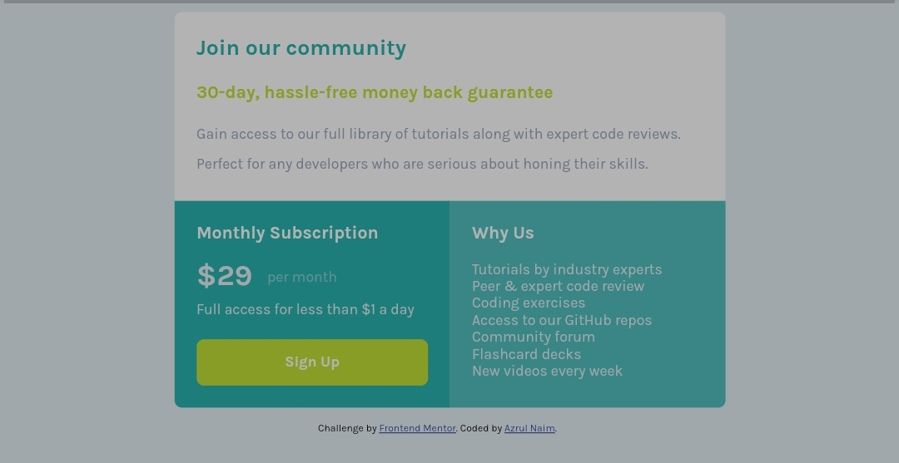

# Frontend Mentor - Single price grid component solution

This is a solution to the [Single price grid component challenge on Frontend Mentor](https://www.frontendmentor.io/challenges/single-price-grid-component-5ce41129d0ff452fec5abbbc). Frontend Mentor challenges help you improve your coding skills by building realistic projects. 

## Table of contents

- [Overview](#overview)
  - [The challenge](#the-challenge)
  - [Screenshot](#screenshot)
  - [Links](#links)
- [My process](#my-process)
  - [Built with](#built-with)
  - [What I learned](#what-i-learned)
  - [Continued development](#continued-development)
- [Author](#author)


## Overview

### The challenge

Users should be able to:

- View the optimal layout for the component depending on their device's screen size
- See a hover state on desktop for the Sign Up call-to-action

### Screenshot
#### Mobile


#### desktop



### Links

- Solution URL: [Add solution URL here](https://your-solution-url.com)
- Live Site URL: [Add live site URL here](https://your-live-site-url.com)

## My process

### Built with

- Semantic HTML5 markup
- CSS custom properties
- CSS Grid
- Mobile-first workflow
- [React](https://reactjs.org/) - JS library
- [Next.js](https://nextjs.org/) - React framework
- [Styled Components](https://styled-components.com/) - For styles


### What I learned

```html
<div class="container">
  <section class="community"></section>
  <section class="subscription"></section>
  <section class="why-us"></section>
</div>
```
```css
  .container {
    display: grid;
    grid-template-areas: 'top top'
      'left right';
    grid-template-columns: 50% 50%;
  }
  
  .community {
    grid-area: top;
  }
  .subscription {
    grid-area: left;
        border-radius: 0 0 0 0.5em;
  }
  .why-us {
    grid-area: right;
    border-radius: 0 0 0.5em 0;
  }
```


### Continued development

css grid


## Author

- Website - [Azrul Naim](https://www.sjtape.github.io)
- Frontend Mentor - [@sjtape](https://www.frontendmentor.io/profile/sjtape)

